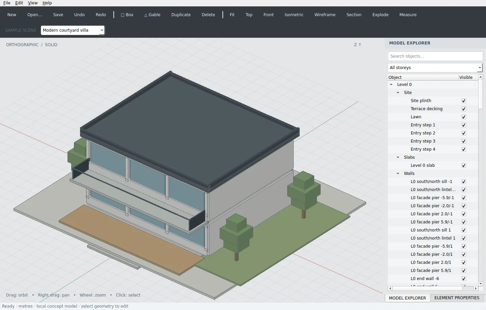
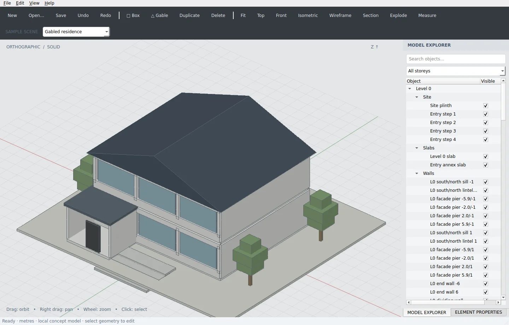
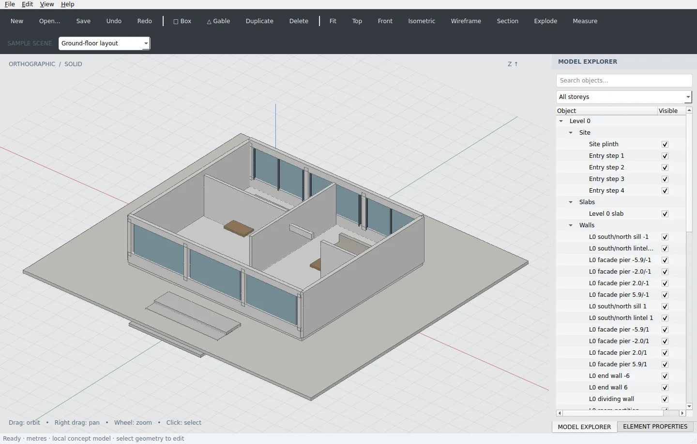

# 3D-BIM Desktop

An original native desktop architectural concept editor inspired by the supplied CAD screenshots. Built with Python, PySide6/Qt and NumPy, with an orthographic software-rendered 3D viewport. This is a desktop application, not a browser wrapper. All bundled house geometry is generated in source.

## Actual desktop captures







## Start on Windows

Install 64-bit Python 3.11 or newer, open a terminal in this repository and run:

```powershell
py -m venv .venv
.\.venv\Scripts\Activate.ps1
python -m pip install -e .
python run.py
```

If PowerShell does not permit activation, use `.venv\Scripts\python.exe -m pip install -e .` and `.venv\Scripts\python.exe run.py` directly.

## Start on Linux or macOS

```sh
python3 -m venv .venv
.venv/bin/python -m pip install -e .
.venv/bin/python run.py
```

A working native Qt display environment is needed for interactive use. The installed entry point `bim-desktop` launches the same application. Optional arguments: a project path, `--scene 0`, `--scene 1`, `--scene 2` or `--snapshot output.png` to save a full-window image and exit.

## Features

- Three original scenes: gabled residence, ground-floor layout and modern courtyard villa.
- Native toolbars, searchable storey/category/object tree, visibility checkboxes and a tabbed property inspector.
- Real opaque mesh rendering with per-pixel depth testing, selection highlighting and XYZ orientation indicators.
- Left-drag orbit, right-drag pan, wheel zoom, fit, front, top and isometric views.
- Create box or gable geometry, duplicate/delete elements and edit dimensions, XYZ position, Z rotation, name, material, category and storey.
- Undo/redo for modeling changes, material colors and visibility. Unsaved-change prompts protect edited projects.
- Storey filtering, wireframe mode, horizontal section clipping and exploded storeys.
- Vertex-to-vertex measurement: click two visible faces to snap to the nearest projected face vertex. The measured XYZ distance is shown in metres. Explosion changes displayed coordinates; disable it for source-geometry measurements.
- Versioned `.bim.json` project loading and atomic saving; export visible source geometry as OBJ and viewport images as PNG.

Choose the sample scene from the second toolbar. Select geometry to open the properties tab. Use the Model Explorer tab to return to the object hierarchy. Edit numeric fields and click **Apply dimensions / transform** to commit one undoable edit. Selecting a model-tree row can inspect a hidden element, so it can be restored with its visibility checkbox.

## Geometry and scope

XYZ coordinates use metres with Z up. Box and triangular gable elements are parametric meshes, with rotation around their own center. The displayed XYZ indicators show orientation; translation is edited in numeric property fields. There is no draggable transform gizmo or general free-form sketch editor.

Project geometry uses lightweight box/gable primitives. Glass is an opaque schematic material. Lighting is flat shaded; the images are real app screenshots, not photorealistic renders. The renderer uses an orthographic projection and CPU Z-buffer, not GPU/OpenGL. It targets small concept scenes and validates a maximum of 1500 elements, with a 5 MB file limit. Large scenes can be slow. Sections clip faces without generating solid caps. Geometry volume is the primitive mesh volume, not a BIM material takeoff.

This is a functional concept modeling foundation, not a replacement for an engineering CAD/BIM package. IFC, Revit, DWG, B-rep solids, boolean operations, constraints, clash detection, surveyed georeferencing and building-code validation are not implemented. Imported data must follow the documented JSON schema; no IFC compatibility is implied by the repository name.

OBJ exports source geometry for elements whose visibility checkbox is enabled. Temporary floor filters, section clipping and exploded view transforms are not baked into the export. No OBJ materials are emitted. Example projects are in `examples/`.

## Tests

```sh
python -m pip install -e '.[test]'
python -m pytest -q
python -m black --check bim tests run.py
```

Native Qt tests use `QT_QPA_PLATFORM=offscreen` and actual widget mouse events. They exercise rendering, selection, measurement, editing, undo/redo, visibility, storey filters, sectioning, saving, loading and exports. Raster tests prove that nearer geometry occludes farther geometry regardless of submission order. See [validation](docs/validation.md) for executed results.

## Windows packaging

```powershell
./scripts/build_windows.ps1
```

The supplied PyInstaller recipe creates `dist/3D-BIM/3D-BIM.exe`. Distribute the entire `dist/3D-BIM` folder. GitHub Actions includes Ubuntu tests and a Windows test/build job with an artifact. Windows executable generation and Windows hardware testing have not been run in the Linux implementation environment; the workflow result must be checked on GitHub before calling that build validated.

## History

Implementation commits were made as work progressed, using current dates. `3D-BIM-history.bundle` preserves the original local Git commits; GitHub-imported commits have separate hashes. No commit history has been backdated or presented as previous client work.

## Third-party dependencies

PySide6/Qt, NumPy and build/test tools retain their own licenses. Review the PySide6/Qt redistribution terms before distributing a packaged executable. No external architectural models, textures or reference screenshots are included in the app assets.
